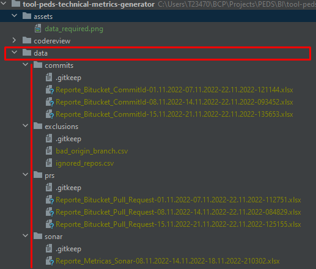

# Metrics project

## Init Project

### Create a virtual environment

```shell
python -m venv venv
```

### Activate venv

```shell
venv\Scripts\activate
```

### Get libs

```shell
pip install -r requirements.txt
```

## Data Required

1. 

| Folder        | Source                                                                                                                                                                                                                                                                                                                                                  |
|---------------|---------------------------------------------------------------------------------------------------------------------------------------------------------------------------------------------------------------------------------------------------------------------------------------------------------------------------------------------------------|
| commits / PRS | Get this data from NodeJS process                                                                                                                                                                                                                                                                                                                       |
| sonar         | [Ticket data](https://jira.lima.bcp.com.pe/browse/INCTSP-15104)                                                                                                                                                                                                                                                                                         |
| Exclusions    | [Folder](https://credicorponline.sharepoint.com/:f:/s/PracticasyEntornosdeDesarrollodeSoftware/EmdAMocPp5pFlOJ9uCV7V8QBlQyfupHtcOfKJN5ddC1JlA?e=BS9hNU)                                                                                                                                                                                                 |
| Survey        | [Folder](https://credicorponline.sharepoint.com/sites/PracticasyEntornosdeDesarrollodeSoftware/Documentos%20compartidos/Forms/AllItems.aspx?ct=1669995748862&or=Teams%2DHL&ga=1&id=%2Fsites%2FPracticasyEntornosdeDesarrollodeSoftware%2FDocumentos%20compartidos%2FGeneral%2F2022%2DQ3%2FEncuesta&viewid=58a7e3e0%2D92dc%2D4eae%2Dbd2c%2Ded4a2d58e1a7) |
| Base Activos  | [Folder](https://credicorponline.sharepoint.com/sites/PracticasyEntornosdeDesarrollodeSoftware/Documentos%20compartidos/Forms/AllItems.aspx?RootFolder=%2Fsites%2FPracticasyEntornosdeDesarrollodeSoftware%2FDocumentos%20compartidos%2FGeneral%2FCronograma%20de%20despliegues%2FBase%20de%20Activos)                                                  |

## Steps to execute

| Name              | Params                             | Execute as | Sample                                        |
|-------------------|------------------------------------|------------|-----------------------------------------------|
| prepare_input     | YYYYMMdd YYYYMMdd                  | Script     | python prepare_input.py  20221101 20221130    | 
| metrics           | YYYYMM [java, web, mobile, empty]  | Module     | python -m codereview.metrics 202211 java      |                               
| sonar_v2          | MM YYYY [java, web, mobile, empty] | Module     | python -m unittesting.sonar_v2 11 2022 java   |
| pr_metrics_status | YYYYMM                             | Module     | python -m codereview.pr_status_metrics 202211 |

> With each speciality param a new folder is created [java, web, mobile], if no param is passed is considered as global
> report, and speciality folder is not created

## Last Maturity Level note

> To take last month's note, include within the path "/input/ut/last_process/specialty" the corresponding maturity level
> csv file

# CODING STANDARD METRIC GENERATOR
generate coding standard metric

Input Metrics:: [Folder](https://credicorponline.sharepoint.com/:f:/s/Equipodata/EmgLk3jsSVBOhxXoEWO4j4sB6Da5r4QDP6bTf8N9ozNf4g?e=Gl6TBy)

### step 1:
add xxxxxx-cr-maturity-level-by-squad.csv file into "input/maturity_level_by_squad" folder

### step 2:
add xxxxxx-cr-prs-with-sonar-executions.csv file into "input/maturity_level_by_squad" folder

### step 3:
add Reporte_Metricas_sonar_xxxxxxxx.xlsx file(s) into "input/sonar" folder

### step 4:
add base_activos.xlsx file into "input/base_activos" folder

### step 5:
add Reporte-fortify-Cert-xxxxx-xxxxx.xlsx file(s) into "input/fortify" folder
find this file in: [Confluence](https://confluence.lima.bcp.com.pe/display/DB/Reportes+de+Fortify)

### step 6:
add quiz.xlsx by specialty files into "input/quiz" folder

### step 7:
from console, and into "coding_standard" folder and run:
```
python execute.py <AnioMonthDay>
```
example: "python execute.py 20231103" (this param is last date period that will be include in report)
after execute this process, you can see into output folder the corresponding output Excel files

